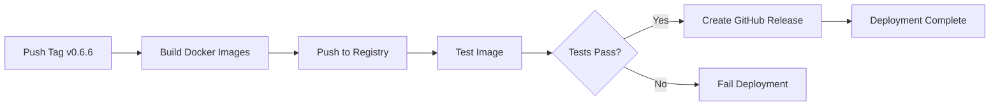

# CI/CD Pipeline Guide

**Version:** 0.6.6  
**Last Updated:** October 28, 2025

This guide covers the Continuous Integration and Continuous Deployment (CI/CD) pipelines for SynFinance using GitHub Actions.

---

## Table of Contents

1. [Overview](#overview)
2. [Pipelines](#pipelines)
3. [Continuous Integration](#continuous-integration)
4. [Continuous Deployment](#continuous-deployment)
5. [Performance Benchmarks](#performance-benchmarks)
6. [Setup Instructions](#setup-instructions)
7. [Workflow Triggers](#workflow-triggers)
8. [Best Practices](#best-practices)
9. [Troubleshooting](#troubleshooting)

---

## Overview

SynFinance uses **GitHub Actions** for automated CI/CD workflows:

- **CI (Continuous Integration):** Automated testing, linting, and quality checks
- **CD (Continuous Deployment):** Automated Docker image building and deployment
- **Benchmarking:** Performance regression detection

### Benefits

✅ **Automated Quality Assurance**
- Run 516 tests on every commit
- Code linting and type checking
- Security scanning

✅ **Fast Feedback**
- Results in 5-10 minutes
- Parallel execution across multiple OS/Python versions
- Detailed test reports

✅ **Automated Deployments**
- Docker image building and publishing
- Version tagging
- Release notes generation

✅ **Performance Tracking**
- Weekly benchmark runs
- Regression detection (50% threshold)
- Historical performance data

---

## Pipelines

### 1. CI Pipeline (`.github/workflows/ci.yml`)

**Purpose:** Ensure code quality on every push/PR

**Jobs:**
1. **Lint:** Code formatting, import sorting, linting
2. **Type Check:** Static type analysis with MyPy
3. **Test:** Run 516 tests across Python 3.11/3.12, Ubuntu/Windows
4. **Performance:** Quick performance checks
5. **Security:** Vulnerability scanning

**Runs on:** Every push and pull request to `main` or `develop`

**Duration:** ~10-15 minutes

### 2. CD Pipeline (`.github/workflows/cd.yml`)

**Purpose:** Build and publish Docker images on releases

**Jobs:**
1. **Build and Push:** Multi-platform Docker images
2. **Test Docker:** Verify image functionality
3. **Create Release:** Generate GitHub release with changelog
4. **Summary:** Deployment status report

**Runs on:** Version tags (e.g., `v0.6.6`)

**Duration:** ~20-30 minutes

### 3. Benchmark Pipeline (`.github/workflows/benchmark.yml`)

**Purpose:** Track performance over time

**Jobs:**
1. **Benchmark:** Main performance suite
2. **Parallel:** Parallel generation performance
3. **Streaming:** Streaming generation performance
4. **Cache:** Cache performance
5. **Summary:** Aggregate results

**Runs on:** 
- Weekly schedule (Sunday 2 AM UTC)
- Push to performance-related code
- Manual trigger

**Duration:** ~15-20 minutes

---

## Continuous Integration

### Workflow Details

#### Job 1: Lint

**Tools:**
- **Black:** Code formatting
- **isort:** Import sorting
- **Flake8:** PEP 8 compliance
- **Pylint:** Static analysis

**Commands:**
```bash
black --check src/ tests/ examples/
isort --check-only src/ tests/ examples/
flake8 src/ tests/ examples/ --max-line-length=120
pylint src/ --max-line-length=120
```

**Pass Criteria:** All checks pass (warnings allowed)

#### Job 2: Type Check

**Tool:** MyPy

**Command:**
```bash
mypy src/ --ignore-missing-imports --no-strict-optional
```

**Pass Criteria:** No type errors

#### Job 3: Test

**Matrix Strategy:**
- OS: Ubuntu, Windows
- Python: 3.11, 3.12

**Total Combinations:** 4 (2 OS × 2 Python versions)

**Commands:**
```bash
pytest tests/ -v \
  --cov=src \
  --cov-report=xml \
  --cov-report=html \
  --cov-report=term \
  --maxfail=5 \
  --tb=short
```

**Coverage Upload:** Codecov (Ubuntu + Python 3.12 only)

**Pass Criteria:** All 516 tests pass

#### Job 4: Performance

**Command:**
```bash
pytest tests/performance/ -v \
  --benchmark-only \
  --benchmark-json=benchmark.json
```

**Pass Criteria:** No performance regressions

#### Job 5: Security

**Tools:**
- **Safety:** Dependency vulnerability scan
- **Bandit:** Security linter

**Commands:**
```bash
safety check --json
bandit -r src/ -f json -o bandit-report.json
```

**Pass Criteria:** No critical vulnerabilities

---

## Continuous Deployment

### Build Process

#### Multi-Platform Images

Builds for:
- `linux/amd64` (Intel/AMD 64-bit)
- `linux/arm64` (ARM 64-bit, Apple M1/M2)

**Build Command:**
```bash
docker buildx build \
  --platform linux/amd64,linux/arm64 \
  --push \
  -t ghcr.io/synfinance/synfinance:latest \
  .
```

#### Image Tags

Generated tags:
- `latest` - Latest stable release
- `v0.6.6` - Specific version
- `0.6` - Major.minor version
- `0` - Major version
- `sha-abc1234` - Git commit SHA
- `dev` - Development image

**Example:**
```
ghcr.io/synfinance/synfinance:latest
ghcr.io/synfinance/synfinance:v0.6.6
ghcr.io/synfinance/synfinance:0.6
ghcr.io/synfinance/synfinance:dev
```

### Deployment Flow



### Release Process

1. **Tag version:**
   ```bash
   git tag v0.6.6
   git push origin v0.6.6
   ```

2. **CI/CD automatically:**
   - Builds Docker images
   - Runs tests in container
   - Publishes to GitHub Container Registry
   - Creates GitHub Release with changelog

3. **Manual verification:**
   ```bash
   docker pull ghcr.io/synfinance/synfinance:v0.6.6
   docker run -p 8000:8000 ghcr.io/synfinance/synfinance:v0.6.6
   curl http://localhost:8000/health
   ```

---

## Performance Benchmarks

### Benchmark Schedule

**Weekly:** Sunday at 2 AM UTC

**Manual Trigger:** 
```bash
# Via GitHub UI: Actions → Performance Benchmarks → Run workflow
```

### Tracked Metrics

1. **Parallel Generation:**
   - Transaction throughput (txns/sec)
   - Memory usage (MB)
   - Scaling efficiency

2. **Streaming Generation:**
   - Memory footprint
   - Batch processing time
   - File I/O performance

3. **Cache Performance:**
   - Hit/miss rates
   - Lookup latency
   - Memory overhead

### Regression Detection

**Alert Threshold:** 150% of baseline (50% degradation)

**Action on Alert:**
- Comment on commit
- Send notification
- Mark workflow as warning (not failure)

**Example Alert:**
```
⚠️ Performance Regression Detected

Metric: parallel_generation_throughput
Baseline: 10,000 txns/sec
Current: 6,500 txns/sec
Degradation: 35%

Commit: abc1234
```

---

## Setup Instructions

### 1. Fork Repository

```bash
git clone https://github.com/yourusername/synfinance.git
cd synfinance
```

### 2. Configure Secrets

Go to: **Settings → Secrets and variables → Actions**

Required secrets:

| Secret | Description | How to Get |
|--------|-------------|------------|
| `GITHUB_TOKEN` | GitHub API token | Auto-provided by GitHub |
| `DOCKERHUB_USERNAME` | Docker Hub username | Optional, for Docker Hub |
| `DOCKERHUB_TOKEN` | Docker Hub token | Optional, for Docker Hub |

Optional secrets for advanced features:

| Secret | Description |
|--------|-------------|
| `CODECOV_TOKEN` | Codecov upload token |
| `SLACK_WEBHOOK` | Slack notifications |

### 3. Enable Workflows

1. Go to **Actions** tab
2. Enable workflows if prompted
3. Workflows will run automatically on next push

### 4. Test CI Pipeline

```bash
# Create a branch
git checkout -b test-ci

# Make a change
echo "# Test" >> README.md

# Commit and push
git add .
git commit -m "Test CI pipeline"
git push origin test-ci

# Create pull request
# CI will run automatically
```

### 5. Test CD Pipeline

```bash
# Tag a release
git tag v0.6.6-test
git push origin v0.6.6-test

# CD will run automatically
# Check Actions tab for progress
```

---

## Workflow Triggers

### CI Workflow

**Triggers:**
```yaml
on:
  push:
    branches: [ main, develop ]
  pull_request:
    branches: [ main, develop ]
  workflow_dispatch:  # Manual trigger
```

**Runs on:**
- Every push to `main` or `develop`
- Every pull request targeting `main` or `develop`
- Manual trigger from GitHub UI

### CD Workflow

**Triggers:**
```yaml
on:
  push:
    tags:
      - 'v*.*.*'  # e.g., v0.6.6, v1.0.0
  release:
    types: [published]
  workflow_dispatch:
    inputs:
      version:
        description: 'Version tag'
        required: true
```

**Runs on:**
- Version tag push (e.g., `v0.6.6`)
- GitHub Release published
- Manual trigger with version input

### Benchmark Workflow

**Triggers:**
```yaml
on:
  schedule:
    - cron: '0 2 * * 0'  # Weekly, Sunday 2 AM UTC
  push:
    branches: [ main ]
    paths:
      - 'src/performance/**'
      - 'tests/performance/**'
  workflow_dispatch:
```

**Runs on:**
- Weekly schedule
- Changes to performance code
- Manual trigger

---

## Best Practices

### 1. Branch Strategy

```
main (protected)
  ← develop (default)
      ← feature/xxx
      ← bugfix/xxx
```

**Rules:**
- All changes via pull requests
- CI must pass before merge
- Require code review
- No direct commits to `main`

### 2. Commit Messages

Follow conventional commits:

```
feat: add parallel generation feature
fix: resolve memory leak in cache
docs: update Docker guide
test: add streaming generator tests
perf: optimize transaction generation
```

### 3. Version Tagging

**Semantic Versioning:** `MAJOR.MINOR.PATCH`

```bash
# Bug fixes
git tag v0.6.7

# New features (backward compatible)
git tag v0.7.0

# Breaking changes
git tag v1.0.0
```

### 4. Pull Request Checks

**Required:**
- ✅ All tests pass
- ✅ Code coverage maintained
- ✅ Linting passes
- ✅ No security vulnerabilities

**Optional:**
- Type checking passes
- Performance benchmarks stable

### 5. Monitoring

**Check workflow status:**
```bash
# Via GitHub CLI
gh run list --workflow=ci.yml

# View specific run
gh run view 123456789

# Watch in real-time
gh run watch 123456789
```

**Email notifications:**
- Settings → Notifications → Actions
- Choose notification preferences

---

## Troubleshooting

### Common Issues

#### Workflow Not Triggering

**Check:**
1. Workflow file syntax (YAML valid?)
2. Trigger conditions match
3. Workflows enabled for repository

**Solution:**
```bash
# Validate workflow syntax
yamllint .github/workflows/ci.yml

# Manual trigger
gh workflow run ci.yml
```

#### Tests Failing in CI but Passing Locally

**Causes:**
- Environment differences
- Missing dependencies
- Timezone/locale differences
- File path issues (Windows vs Linux)

**Solution:**
```bash
# Run tests in Docker (matches CI environment)
docker run -it --rm -v $(pwd):/app python:3.12 bash
cd /app
pip install -r requirements.txt
pytest tests/
```

#### Docker Build Failing

**Check:**
1. Dockerfile syntax
2. Build context size
3. Network connectivity

**Solution:**
```bash
# Test build locally
docker build -t synfinance:test .

# Check build logs
docker build --no-cache --progress=plain -t synfinance:test .
```

#### Secrets Not Available

**Symptoms:**
- `secrets.DOCKERHUB_TOKEN` is empty
- Authentication fails

**Solution:**
1. Verify secrets are set in Settings → Secrets
2. Check secret names match workflow
3. Ensure using `secrets.` prefix

#### Performance Regression Alerts

**Action:**
1. Review recent changes
2. Run benchmarks locally
3. Profile slow functions
4. Optimize or update baseline

```bash
# Run benchmarks locally
pytest tests/performance/ --benchmark-only
```

---

## Advanced Configuration

### Custom Runners

Use self-hosted runners for:
- Faster builds
- Specific hardware (GPU)
- Private network access

**Setup:**
```yaml
runs-on: [self-hosted, linux, x64]
```

### Matrix Builds

Test multiple configurations:

```yaml
strategy:
  matrix:
    python: [3.11, 3.12, 3.13]
    os: [ubuntu-latest, windows-latest, macos-latest]
    include:
      - python: 3.12
        os: ubuntu-latest
        coverage: true
```

### Caching

Speed up workflows with caching:

```yaml
- uses: actions/cache@v3
  with:
    path: ~/.cache/pip
    key: ${{ runner.os }}-pip-${{ hashFiles('requirements.txt') }}
```

### Artifacts

Save build outputs:

```yaml
- uses: actions/upload-artifact@v3
  with:
    name: test-results
    path: |
      htmlcov/
      coverage.xml
```

---

## Additional Resources

- **GitHub Actions Documentation:** https://docs.github.com/en/actions
- **Docker Build Push Action:** https://github.com/docker/build-push-action
- **Codecov Action:** https://github.com/codecov/codecov-action
- **SynFinance Docker Guide:** [DOCKER_GUIDE.md](./DOCKER_GUIDE.md)

---

**Last Updated:** October 28, 2025  
**Version:** 0.6.6  
**Pipeline Status:** [](https://github.com/synfinance/synfinance/actions)
